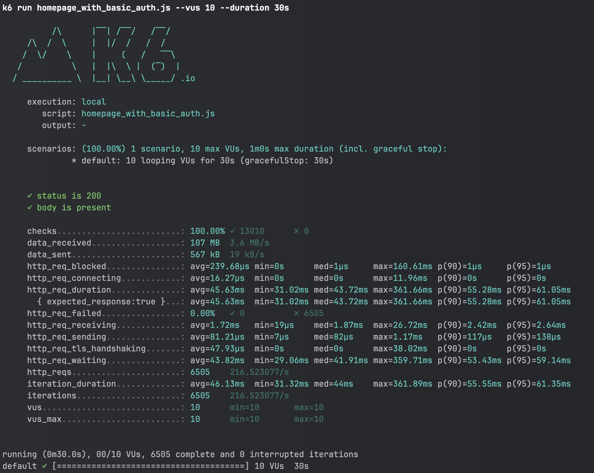

# Performance Test

This repository contains performance tests examples for web applications.
The test is based on the [Grafana K6](https://k6.io/) tool.

## How to run the test

1. Install the K6 tool. You can find the installation instructions [here](https://k6.io/docs/getting-started/installation/).

2. Clone this repository.

3. Create a `config.json` file based on the `config.example.json` file and fill in the necessary information.

4. Run the test with the following command:

```bash
 k6 run homepage_with_basic_auth.js
```

or with web dashboard:

```bash
 k6 run homepage_with_basic_auth.js --out web-dashboard
```

by default, the test will run with scenario defined in the `confing.js` file, but you can override it with the following command:

```bash
 k6 run homepage_with_basic_auth.js --vus 20 --duration 40s
```

Your test results will be executed with 20 virtual users for 40 seconds.

## Test results

The test results will be displayed in the terminal or in the web dashboard.



The most important metrics are:

- **http_req_duration**: The time it took to complete the request.
- **http_req_failed**: The number of failed requests.
- **iterations**: Total number of iterations.

## License

This project is licensed under the MIT License - see the [LICENSE](LICENSE) file for details.
